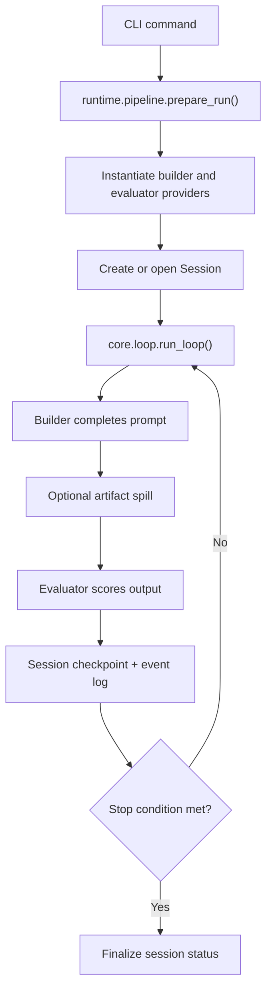

# Architecture

## Overview

`superteam` is a Python harness for running non-interactive builder/evaluator loops. A pipeline defines two agents, the runtime instantiates their providers, the core loop coordinates iterations, and the session layer persists state and artifacts on disk.

## Package Layout

- `src/superteam/core/`
  - `contracts.py`: dataclasses for `LoopState`, `Verdict`, `IterationRecord`, `SessionMeta`, and `Event`
  - `loop.py`: prompt assembly, verdict parsing, artifact spilling, retry logic, and loop termination
  - `observe.py`: event emission to stdout and/or persisted JSONL logs
  - `session.py`: session directories, atomic writes, checkpoints, and state recovery
- `src/superteam/runtime/`
  - `config.py`: global config loading plus deep-merge helpers
  - `pipeline.py`: YAML pipeline loading, provider registry, config resolution, and run preparation
- `src/superteam/providers/`
  - Provider packages for `claude_api`, `claude_code`, and `openrouter`
  - `testing.py` provides deterministic static builder/evaluator fakes for tests
- `src/superteam/cli/`
  - Typer commands for `run`, `watch`, `status`, `result`, `sessions list`, and `audit`
- `src/superteam/pipelines/`
  - Built-in YAML pipeline specs shipped as package data

## Runtime Flow



### `run` command path

1. `src/superteam/cli/run.py` resolves a pipeline reference and optional goal/plan overrides.
2. `prepare_run()` loads the pipeline YAML, merges global provider config, and instantiates concrete provider classes.
3. A `Session` is created or reopened for background execution.
4. `run_loop()` drives iterations until a pass/fail condition or max-iteration policy is reached.
5. The final state is persisted, and the CLI prints the session id plus resolved output for foreground runs.

### `audit` command path

`src/superteam/cli/audit.py` skips the builder loop entirely. It reads piped content from stdin, instantiates a single evaluator provider, and runs the same verdict parsing logic used by the main loop.

## Core Data Model

### `LoopState`

The mutable state for a run. It carries:

- session identity
- goal and plan
- current iteration number
- latest output or spilled artifact reference
- evaluator feedback
- optional context payload
- iteration history

### `Verdict`

The evaluator response contract. The core loop expects JSON with:

- `status`: `pass`, `fail`, or `retry`
- `feedback`: actionable guidance for the next builder pass
- `score`: optional numeric confidence/quality score

### `IterationRecord`

The append-only summary of each loop step, including output preview, artifact reference, verdict, and token accounting when available.

## Persistence Model

Sessions are file-backed under `SUPERTEAM_HOME` or `~/.superteam` by default.

Each session directory follows this shape:

```text
~/.superteam/sessions/<session-id>/
  meta.json
  state.json
  events.jsonl
  run.pid
  iterations/
    001.json
    001.verdict.json
  artifacts/
    001.artifact
  workspace/
```

### Persistence rules

- Metadata and state writes are atomic.
- Event logs are append-only JSONL.
- Large builder outputs spill to `artifacts/` once they cross `OUTPUT_INLINE_LIMIT`.
- `state.json` always represents the latest known loop state.

## Configuration And Pipelines

Pipelines are YAML specs that define:

- pipeline metadata
- loop configuration such as max iterations and retry policy
- builder provider, system prompt, and provider config
- evaluator provider, system prompt, and provider config
- default input values such as `goal` and `plan`

Config precedence is:

`CLI args > pipeline YAML > global config (~/.superteam/config.toml)`

Global config is merged per provider and for loop settings before providers are instantiated.

## Provider Boundary

Providers are expected to expose:

- `complete(system, prompt, state=None) -> str`
- `health() -> bool`

The loop wraps providers with `_LoopProvider` to add:

- observer events
- transient retry handling
- token usage capture when the provider exposes it

## Testing Strategy

The test suite is designed to run without live API access.

- Use `src/superteam/providers/testing.py` for deterministic loop tests.
- Use `SUPERTEAM_HOME` isolation in tests that touch session persistence.
- Prefer focused tests around loop control flow, session layout, config merging, and CLI argument behavior.

## Extension Checklist

### Adding a provider

- Add the provider package under `src/superteam/providers/`
- Export it from `src/superteam/providers/__init__.py`
- Register it in `src/superteam/runtime/pipeline.py`
- Document required dependencies and env vars in `README.md`
- Add focused tests and, if appropriate, a smoke test

### Changing session/state behavior

- Update `core/contracts.py` and/or `core/session.py`
- Review compatibility with existing on-disk sessions
- Update architecture docs and tests that assert persisted layout

### Adding a built-in pipeline

- Add the YAML file under `src/superteam/pipelines/`
- Register the name in `BUILTIN_PIPELINES`
- Cover loading and defaults with tests
- Add user-facing documentation if the pipeline is intended for general use
